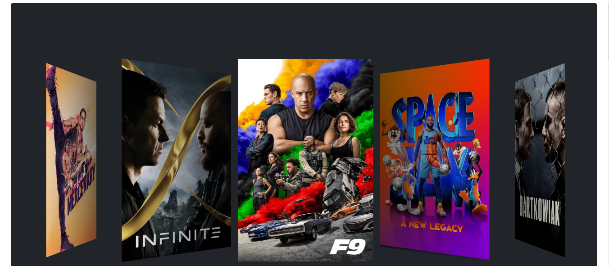
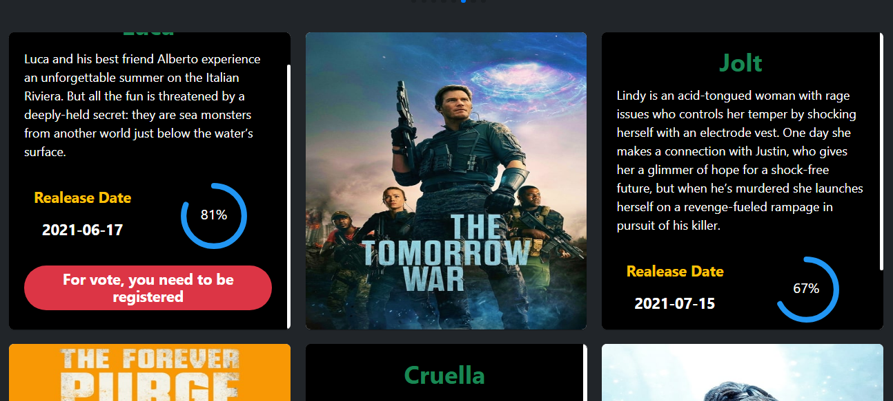

# MOVIES APP

# INFO

An application built in react, redux and firebase to use an API.
Using Query Params, Axios, Styled Components, Bootstrap and Thunk

## LINKS 🔗
- GitHub URL: [Repository](https://github.com/stevenmanriqueca/Movie-App)
- Live Site URL: [GitHub Pages](https://stevenmanriqueca.github.io/Movie-App/)

### `npm start`

Runs the app in the development mode.\
Open [http://localhost:3000](http://localhost:3000) to view it in the browser.

The page will reload if you make edits.\
You will also see any lint errors in the console.

### SCREENSHOTS




TO CLONE:
```
git clone https://github.com/stevenmanriqueca/Movie-App.git
```